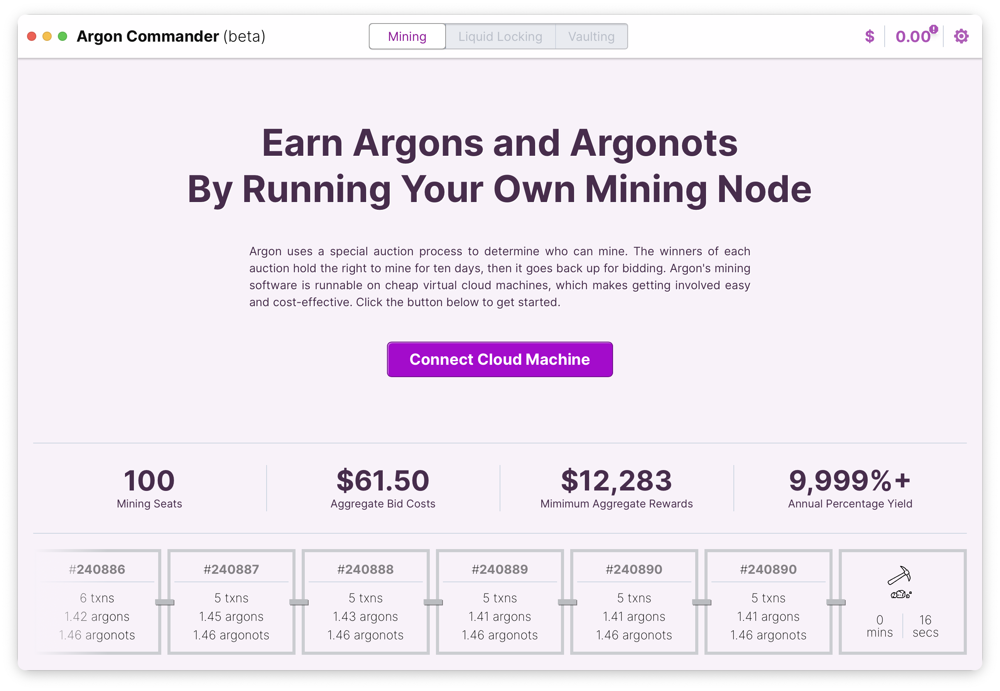
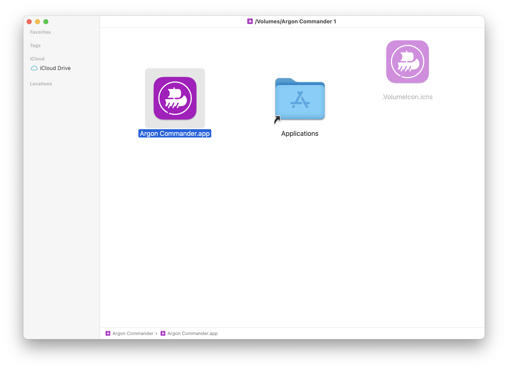
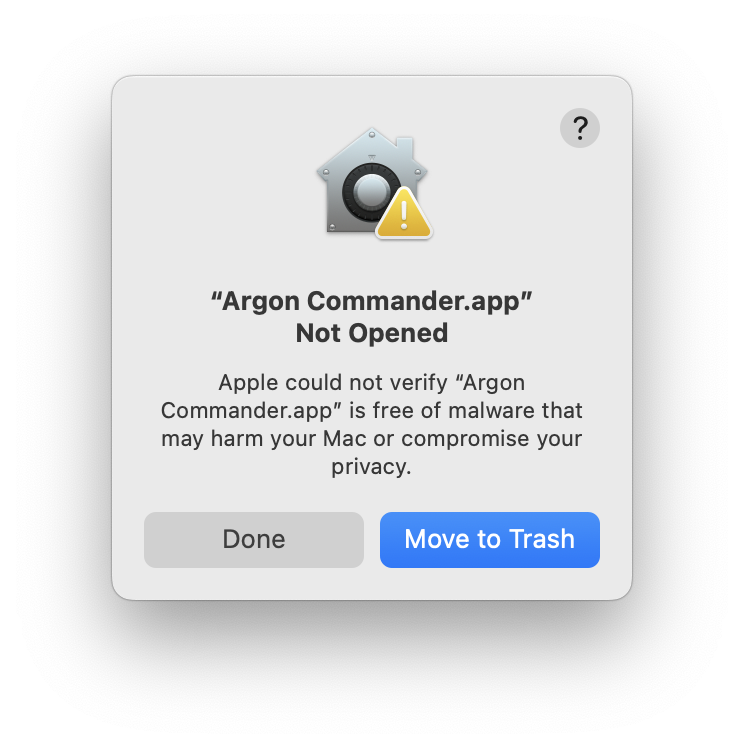
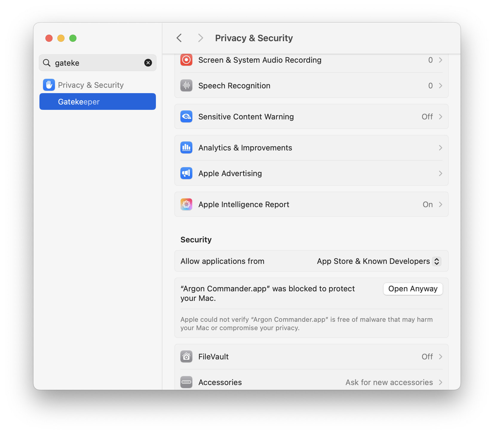
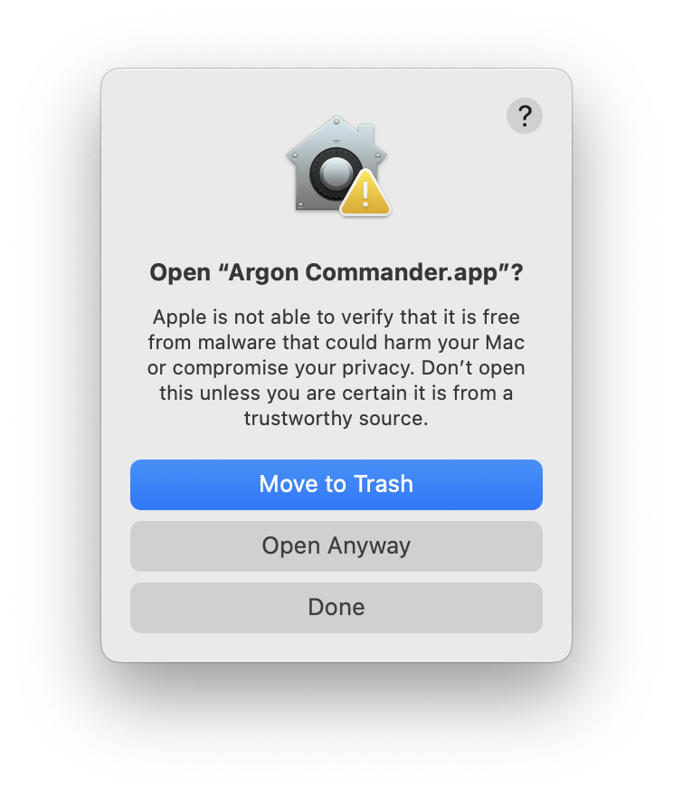

# Argon Commander

Argon Commander is a desktop application that helps you interact with the [Argon](https://argon.network) mainchain.
Among the core activities are:

- **Mining**: Argon is a proof-of-authorized-work blockchain. Use Argon Commander to mine Argon tokens.
- **Liquid Locking** Secure Bitcoins into Vaults to unlock the equivalent Argon liquidity.
- **Run a Vault** Run a vault. Earn interest by collateralizing Bitcoin Locks.



## Features

### Mining

Become an Argon Miner, even if you don't know have the technical background to manage a server.

The workflow will help you:

- Provision a cloud machine (current providers are [`Digital Ocean`])
- Calculate a profitable "bid" amount
- Configure a bidding "bot" to win 1 or more mining seats
- Monitor your bids and earnings

### Liquid Locking

Liquid Locking is a way to lock Bitcoin into a vault, and receive Argon tokens in return. This is a way to unlock the
liquidity of your Bitcoin, while still maintaining custody. Your Bitcoin Lock produces an option against the Argon
network that can be called by burning Argons to release your Bitcoin. If the Argon price is below target, this can
result in arbitrage opportunities.

Activities:

- Create a Bitcoin Lock
- Wait for a vault to have enough capacity to accept your Bitcoin
- Ratchet or Release your Bitcoin Lock
- Bond argons to a liquidity pool to provide liquidity to new Bitcoin "lock-ers"

> This part of the tool is still under construction

### Vaults

Vaults provide collateralization security to Bitcoin Lockers. As a Vault operator, you are able to set the APR per Argon
for Bitcoin Locks, as well as the percent you're willing to share with Liquidity Pool providers (for more details, refer
to the Argon documentation amd white-papers).

Activities:

- Create a Vault
- Cosign Bitcoin Lock release-requests
- Monitor Liquidity Pool returns

#### Testing Vaults
You can run the docker-compose file that's in the mainchain repository to access bitcoin liquidity to test with (locally). Run the docker per instructions in the [Argon Mainchain repository](https://github.com/argon-network/mainchain/tree/main/README.md#running-from-docker).

You will need the following commands to run against the cli locally:

```bash
# Send bitcoin to the cosign address (replace with your address/amount)
docker compose --profile tooling run --rm btc-cli sendtoaddress bcrt1qwyf38ct4yzdd4vqfwa0mtr2qw49n62y8me970737nfea3a7asmhqjcwjfc 0.00039045

# Get a destination address for released bitcoin
docker compose --profile tooling run --rm btc-cli getnewaddress

# Broadcast the released bitcoin
docker compose --profile tooling run --rm btc-cli sendrawtransaction 020000000001016aa1e38d96312ee99386a13c443bcc38e2c8cb84d55ed779d62...

# Check the status of the bitcoin transaction
docker compose --profile tooling run --rm btc-cli gettransaction 020000000001016aa1e38d96312ee99386a13c443bcc38e2c8cb84d55ed779d62...

```
## Installation

This project has an automated action to build from the source of the project for each release. The action is triggered
by a push to a `version` branch. These releases are guaranteed to match a git hash, so you can see what you're
installing. However, they are unsigned, so will require steps to open on Mac/Windows.

Downloads are available for each "release" on the [releases page](./releases/latest).

### Mac

1. Download the latest "dmg" installer from the [releases page](./releases/latest).
2. Click to run the installer once downloaded
    - Drag the `Argon Commander` app to your Applications folder
      
3. Try to open the app once (it will be blocked and prompt you to move it to the trash)
    - Click `Done`
      <br/>
      
4. Open the "System Settings" app
5. Click `Security & Privacy`
6. Navigate down to `Security`
7. Click "Open Anyway" next to the message about Argon Commander
   <br/>
   
8. Click "Open Anyway" on the pop-up
   <br/>
   
9. You can now open `Argon Commander` from the Applications folder (or a link on your Dock).

### Windows

1. Download the latest windows installer (exe or msi) from the [releases page](./releases/latest).
2. Run the installer
3. You will likely see a screen that says "Windows protected your PC"
    - Click `More info`
      <br/>
4. Click "Run Anyway"
5. Complete the installation

## Building From Source

You can build this project from source by running:

```bash
yarn install
yarn tauri build
```

## Running a Development Server

You can use a local docker as a development server by running:

```bash
docker build -t commander-host -f dev.Dockerfile .
docker run -d --name commander-host-1 -p 2222:22 commander-host
```

When you add your server address during setup, you should append the port `:2222` to the end of the address (ie,
`localhost:2222`). Any local port will be fine if you wish to run multiple.

To add the server configuration SSH key to the server, you can copy the public key to the docker container by running:

```bash
echo '<YOUR KEY>' | docker exec -i commander-host-1 tee -a /root/.ssh/authorized_keys
```

So, as an example, if you want to add a specific key, you can run:

```bash
cat 'ssh-ed25519 AAAAC3NzaC1lZDI1NTE5AAAAINxAnT9A1/gwiFYimdT0R38sWzu6Y4QOE11FvzWj53lm' | docker exec -i commander-host-1 tee -a /root/.ssh/authorized_keys
```

## Using Pre-generated Keys

You can use pre-generated keys to connect to a server. This is useful for testing or if you want to use a specific key
pair. You can provide a `SSH_KEY_FILE` path in an .env file during run of `yarn tauri dev`. The path should point to
your private key, and a public key should be present in the same path with `.pub` appended to the filename (see the `dev.ssh_key` and `dev.ssh_key.pub` files in the repository for an example).
